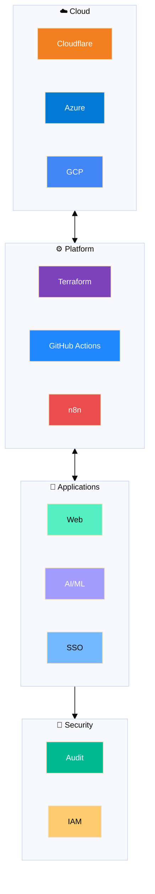
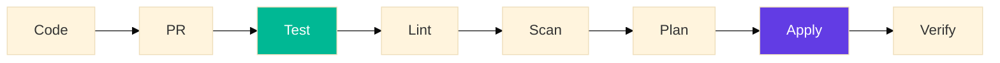
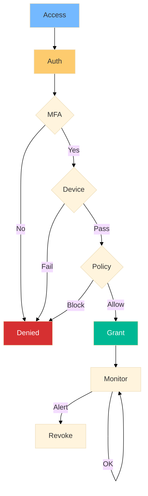

# Patabuga Enterprises System

<!-- Badges -->

> **PES** = Patabuga Enterprise System / Personal Ecosystem  
> Enterprise technology ecosystem for cloud-native infrastructure, AI/ML, and automation.

---

## Table of Contents

1. [About](#about)
2. [Architecture](#architecture)
3. [Technology Stack](#technology-stack)
4. [Key Projects](#key-projects)
5. [Security](#security)
6. [ISO 27001 Compliance](#iso-27001-compliance)
7. [Contact](#contact)

---

## About

**Patabuga Enterprises System (PES)** is an enterprise technology ecosystem for managing cloud-native infrastructure, business process automation, and AI services with **Zero Trust Security** and **ISO 27001** compliance.

### Mission

> Building secure, scalable, and audit-ready technology infrastructure with Infrastructure as Code and Security by Design principles.

---

## Architecture

### System Overview

### CI/CD Flow

---

## Technology Stack

### Cloud Providers

| Provider | Services |
|----------|----------|
| **Cloudflare** | Zero Trust, Workers, Pages, DNS, R2, D1 |
| **Azure** | Cosmos DB, VMs, AD |
| **GCP** | Compute Engine |

### Tools

| Category | Tools |
|----------|-------|
| IaC | Terraform |
| CI/CD | GitHub Actions |
| Automation | n8n |
| Security | Cloudflare Zero Trust, WARP |
| AI/ML | Gemini, RAG, Vector DB |

---

## Key Projects

### 🔐 Security & Identity

| Project | Description |
|---------|-------------|
| **zero-trust-network** | Zero-Trust Network Architecture |
| **pes-sso** | SSO with Cloudflare Access |

### 🏗️ Infrastructure

| Project | Description |
|---------|-------------|
| **sovereign-cloud-fabric** | Multi-Cloud Terraform |
| **pes-infrastructure** | Core Infrastructure (Private) |

### 🤖 AI & Intelligence

| Project | Description |
|---------|-------------|
| **ai-governance-orchestrator** | AI Governance Engine |
| **pes-cortex-engine** | AI with RAG (Private) |

### ⚡ Automation

| Project | Description |
|---------|-------------|
| **pes-production-engine** | Content Production (n8n) |
| **pes-research-panel** | Research Panel (Private) |

### 🌐 Web & Blockchain

| Project | Description |
|---------|-------------|
| **evote-blockchain-dapps** | Decentralized Voting dApp |
| **kalpataru-backend-configuration** | Waste Management Backend |

---

## Security

### Zero Trust Model

### Key Controls

| Control | Implementation |
|---------|----------------|
| A.9.1 | Cloudflare Zero Trust |
| A.9.2 | GitHub Teams + SSO |
| A.9.4 | Zero Trust Network |
| A.12.4.1 | Cloudflare Logpush |
| A.14.2.1 | Terraform + GitHub Actions |

---

## ISO 27001 Compliance

### Commitment

Patabuga Enterprises System implements **ISO/IEC 27001:2022** Information Security Management System.

### Control Domains

| Domain | Status |
|--------|--------|
| A.5-A.10 | ✅ Implemented |
| A.11 | ✅ Cloud Provider |
| A.12-A.14 | ✅ Implemented |
| A.15 | ⚠️ Partial |
| A.16-A.18 | ✅ Implemented |

### Audit Trail

All changes documented in:
- **Git History** — Code changes
- **Terraform State** — Infrastructure state
- **Cloudflare Logs** — Security events
- **GitHub Actions** — Pipeline execution

---

## Statistics

| Metric | Value |
|--------|-------|
| Cloud Providers | 3 |
| Projects | 20+ |
| Compliance Score | 93% |

---

## Contact

| Channel | URL |
|---------|-----|
| 🌐 Website | [patabuga.co](https://patabuga.co) |
| 📧 Email | hq@patabuga.co |
| 📚 Docs | [vsp-docs](https://github.com/vspatabuga/vsp-docs) |
| 🔒 Security | security@patabuga.co |

---

## License

Individual projects have their own licenses. Default: **MIT License**.

---

*🏢 Patabuga Enterprises System — Secure, Scalable, Audit-Ready*  
*🔒 ISO/IEC 27001:2022 Compliant*
