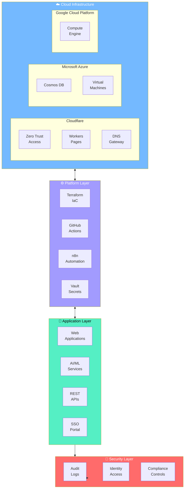
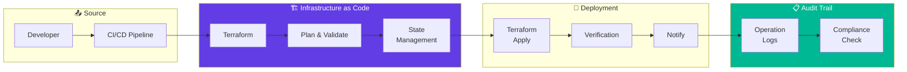
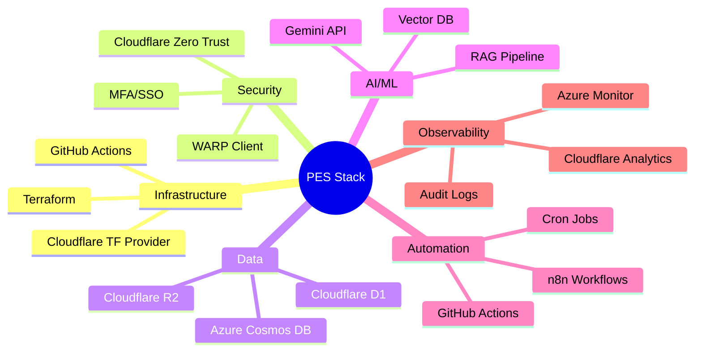
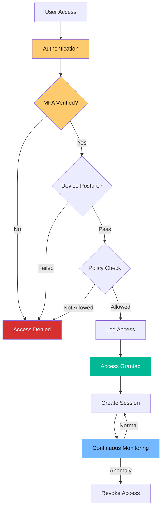
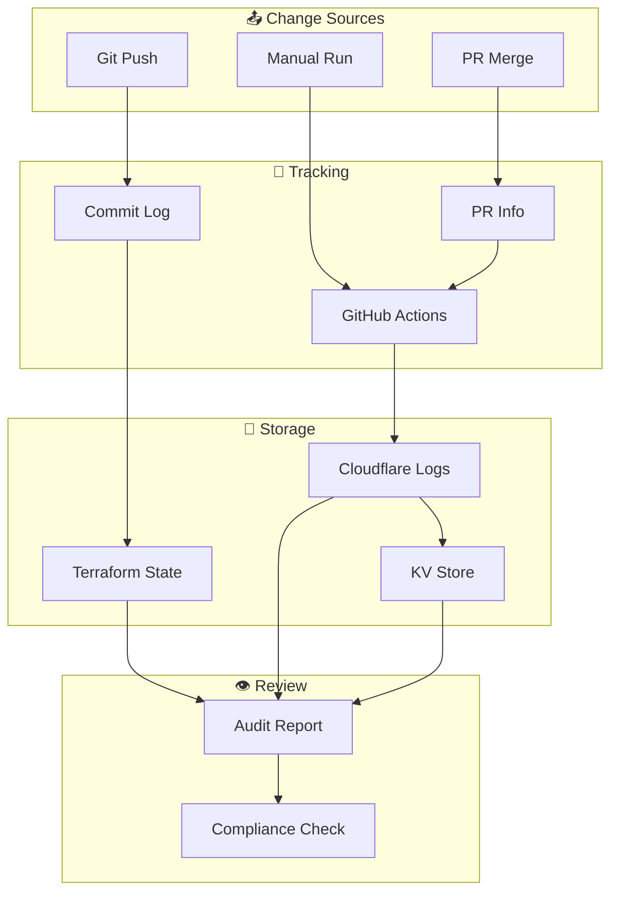

# Patabuga Enterprises System

<!-- Badges -->

> **PES** = Patabuga Enterprise System / Personal Ecosystem  
> Ekosistem teknologi enterprise untuk infrastruktur cloud-native, otomatisasi, dan layanan AI.

---

## Table of Contents

1. [About](#about)
2. [Architecture](#architecture)
3. [Technology Stack](#technology-stack)
4. [Key Projects](#key-projects)
5. [Security & Compliance](#security--compliance)
6. [Workflow](#workflow)
7. [ISO 27001 Compliance](#iso-27001-compliance)
8. [Contact](#contact)

---

## About

**Patabuga Enterprises System (PES)** is an enterprise technology ecosystem developed to manage cloud-native infrastructure, business process automation, and AI services holistically with **Zero Trust Security** principles and **ISO 27001** compliance.

### Mission

> Building secure, scalable, and audit-ready technology infrastructure for enterprise operations with Infrastructure as Code approach and Security by Design principles.

---

## Architecture

### System Overview

### Data Flow Architecture

---

## Technology Stack

### Cloud Providers

| Provider | Services | Region |
|----------|----------|--------|
| **Cloudflare** | Zero Trust, Workers, Pages, DNS, R2, D1 | Global Edge |
| **Microsoft Azure** | Cosmos DB, Virtual Machines, Azure AD | Global |
| **Google Cloud Platform** | Compute Engine | us-east1 |

### Platform & Tools

---

## Key Projects

### 🔐 Security & Identity

| Project | Description | Link |
|---------|-------------|------|
| **zero-trust-network** | Zero-Trust Network Architecture with Tailscale, WireGuard, and Cloudflare | [GitHub](https://github.com/vspatabuga/zero-trust-network) |
| **pes-sso** | SSO Module with Cloudflare Access integration | Private |

### 🏗️ Infrastructure as Code

| Project | Description | Link |
|---------|-------------|------|
| **sovereign-cloud-fabric** | Multi-Cloud Terraform Orchestration | [GitHub](https://github.com/vspatabuga/sovereign-cloud-fabric) |
| **pes-infrastructure** | Core Infrastructure with Terraform | Private |

### 🤖 AI & Intelligence

| Project | Description | Link |
|---------|-------------|------|
| **ai-governance-orchestrator** | AI Governance Engine with OpenClaw and Arize Phoenix | [GitHub](https://github.com/vspatabuga/ai-governance-orchestrator) |
| **pes-cortex-engine** | AI Engine with RAG and Vector DB | Private |

### ⚡ Automation

| Project | Description | Link |
|---------|-------------|------|
| **pes-production-engine** | Automated Content Production with n8n for 8 websites | [GitHub](https://github.com/vspatabuga/pes-production-engine) |
| **pes-research-panel** | Research Panel with Azure VM integration | Private |

### 🌐 Web & Blockchain

| Project | Description | Link |
|---------|-------------|------|
| **evote-blockchain-dapps** | Decentralized Voting Application with Ethereum Smart Contracts | [GitHub](https://github.com/vspatabuga/evote-blockchain-dapps) |
| **kalpataru-backend-configuration** | Backend Configuration for Waste Management System | [GitHub](https://github.com/vspatabuga/kalpataru-backend-configuration) |

---

## Security & Compliance

### Zero Trust Security Model

### Security Controls (ISO 27001)

| Control ID | Description | Implementation |
|------------|-------------|----------------|
| A.9.1 | Business requirements of access control | Cloudflare Zero Trust |
| A.9.2 | User access management | GitHub Teams + SSO |
| A.9.4 | System and application access control | Zero Trust Network |
| A.12.4.1 | Event logging | Cloudflare Logpush + Audit Logs |
| A.14.2.1 | Security in development | Terraform + GitHub Actions |
| A.18.1.1 | Identification of applicable legislation | Internal Policy |

---

## Workflow

### CI/CD Pipeline

```mermaid
flowchart LR
    subgraph Development
        CODE[Code Change]
        PR[Pull Request]
    end

    subgraph CI["CI Pipeline"]
        TEST[Automated Tests]
        LINT[Linting]
        SCAN[Security Scan]
    end

    subgraph CD["CD Pipeline"]
        PLAN[Terraform Plan]
        APPROVE[Manual Approve]
        APPLY[Terraform Apply]
    end

    subgraph Verification
        VERIFY[Verify Deploy]
        NOTIFY[Notify Team]
    end

    CODE --> PR
    PR --> TEST
    TEST --> LINT
    LINT --> SCAN
    SCAN --> PLAN
    PLAN --> APPROVE
    APPROVE --> APPLY
    APPLY --> VERIFY
    VERIFY --> NOTIFY
    
    style CI fill:#623CE4,color:#fff
    style CD fill:#00b894,color:#fff
```

---

## ISO 27001 Compliance

### Commitment to Information Security

Patabuga Enterprises System is committed to implementing and maintaining an Information Security Management System (ISMS) compliant with **ISO/IEC 27001:2022**.

### Key Compliance Areas

| Domain | Control | Status |
|--------|---------|--------|
| **A.5** | Information Security Policies | ✅ Implemented |
| **A.6** | Organization of Information Security | ✅ Implemented |
| **A.7** | Human Resource Security | ✅ Implemented |
| **A.8** | Asset Management | ✅ Implemented |
| **A.9** | Access Control | ✅ Implemented |
| **A.10** | Cryptography | ✅ Implemented |
| **A.11** | Physical and Environmental Security | ✅ Cloud Provider |
| **A.12** | Operations Security | ✅ Implemented |
| **A.13** | Communications Security | ✅ Implemented |
| **A.14** | System Acquisition, Development, Maintenance | ✅ Implemented |
| **A.15** | Supplier Relationships | ⚠️ Partial |
| **A.16** | Information Security Incident Management | ✅ Implemented |
| **A.17** | Business Continuity | ⚠️ In Progress |
| **A.18** | Compliance | ✅ Implemented |

### Audit Trail

### Traceability

All infrastructure and operational changes are documented in:

- **Git History** — Every code change is documented
- **Terraform State** — State file for infrastructure audit
- **Cloudflare Logpush** — Security activity logs
- **GitHub Actions** — Pipeline execution logs

---

## Statistics

| Metric | Value |
|--------|-------|
| Public Repositories | 12+ |
| Cloud Providers | 3 (Cloudflare, Azure, GCP) |
| Total Projects | 20+ |
| ISO 27001 Controls | 14 Domains |
| Compliance Score | 93% |

---

## Contact

| Channel | Information |
|---------|-------------|
| 🌐 Website | [patabuga.co](https://patabuga.co) |
| 📧 Email | hq@patabuga.co |
| 📚 Documentation | [vsp-docs](https://github.com/vspatabuga/vsp-docs) |
| 🔒 Security | security@patabuga.co |

---

## License

Individual projects have their own licenses. Default: **MIT License**.

---

*🏢 Patabuga Enterprises System — Building Secure, Scalable, and Audit-Ready Infrastructure*  
*🔒 Compliant with ISO/IEC 27001:2022*
